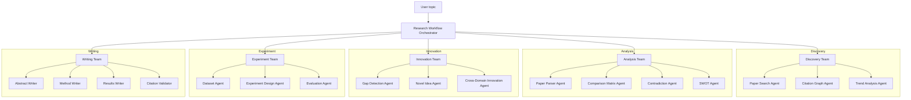
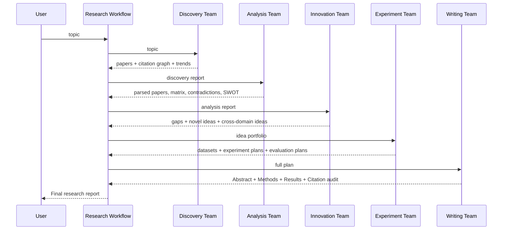
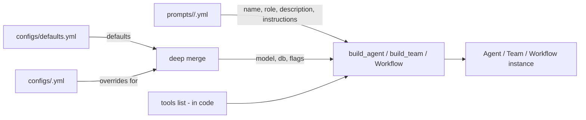
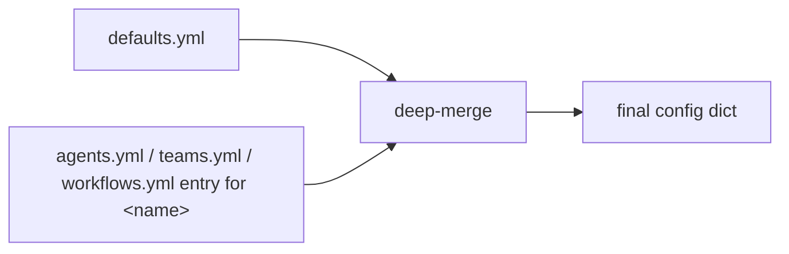
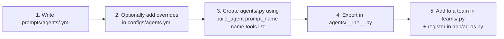

# Research Agent — Architecture & Tuning Guide

This document explains how the `research_agent` system is structured, how the
pieces fit together, and — most importantly — how to **tune** the system by
editing one or two small config files instead of touching code.

---

## 1. High-level architecture

The system implements the diagram below: a workflow orchestrator drives five
specialized teams, each composed of focused single-purpose agents.



The data flow between teams is a strict pipeline — each team's structured
output becomes the next team's input.



---

## 2. Repository layout

```text
research_agent/
├── agents/              # one file per agent + a shared _base.build_agent
│   ├── _base.py
│   ├── search_agent.py
│   ├── citation_graph_agent.py
│   ├── trend_analysis_agent.py
│   ├── parser_agent.py
│   ├── matrix_agent.py
│   ├── contradiction_agent.py
│   ├── swot_agent.py
│   ├── gap_agent.py
│   ├── idea_agent.py
│   ├── cross_domain_agent.py
│   ├── dataset_agent.py
│   ├── experiment_agent.py
│   ├── evaluation_agent.py
│   ├── abstract_writer.py
│   ├── method_writer.py
│   ├── results_writer.py
│   └── citation_validator.py
│
├── teams/               # one file per team + a shared _base.build_team
│   ├── _base.py
│   ├── discovery_team.py
│   ├── analysis_team.py
│   ├── innovation_team.py
│   ├── experiment_team.py
│   └── writing_team.py
│
├── workflows/
│   └── research_workflow.py    # 5-step Agno Workflow
│
├── prompts/             # WHAT each component should DO (text)
│   ├── loader.py
│   ├── agents/<name>.yml       # name, role, description, instructions
│   ├── teams/<name>.yml
│   └── workflows/<name>.yml
│
├── configs/             # HOW each component should RUN (knobs)
│   ├── loader.py
│   ├── defaults.yml            # global defaults
│   ├── agents.yml              # per-agent overrides
│   ├── teams.yml               # per-team overrides
│   └── workflows.yml           # per-workflow overrides
│
├── tools/               # external API tools (arxiv, semantic scholar, ...)
├── storage/             # SQLite session store
└── app/
    └── ag-os.py         # FastAPI / AgentOS entrypoint
```

### The two parallel hierarchies

| Folder       | Purpose                          | What you change here                          |
| ------------ | -------------------------------- | --------------------------------------------- |
| `prompts/`   | Agent / team / workflow **text** | Role, description, instruction list           |
| `configs/`   | Runtime **behavior**             | Model, db, markdown, streaming, json mode, …  |

Code (the files in `agents/`, `teams/`, `workflows/`) simply binds a prompt
file to a config entry and lists the tools an agent uses. You rarely need to
touch the code to tune the system — edit YAML instead.

---

## 3. Component construction flow

Every agent, team, and workflow is constructed the same way:



`configs.loader._deep_merge(defaults, overrides[name])` produces the final
config dict, then `make_model(...)` and `make_db(...)` turn the relevant
sub-trees into live Agno objects.

---

## 4. Configs in detail

### 4.1 `configs/defaults.yml`

Global defaults for every component. Anything you set here applies everywhere
unless an override file says otherwise.

```yaml
model:
  provider: google          # google | openai | anthropic
  id: gemini-2.5-flash
  temperature: null         # null -> provider default

db:
  type: sqlite
  file: research_agent/storage/research_agent.db

agent:
  markdown: true
  stream_events: true
  use_json_mode: false
  structured_outputs: false

team:
  markdown: true
  stream_events: true
  add_datetime_to_context: true
  add_member_tools_to_context: false

workflow:
  stream_events: true
```

### 4.2 `configs/agents.yml` (and teams.yml / workflows.yml)

Per-component overrides keyed by the **prompt name** (matches the YAML file
under `prompts/agents/<name>.yml`).

```yaml
search:
  agent:
    use_json_mode: true     # search agent emits structured JSON
    markdown: false

citation_graph:
  agent:
    use_json_mode: true
    markdown: false

paper_parser: {}            # no overrides -> uses defaults
```

### 4.3 Merge order



`_deep_merge` recurses into nested dicts so you only need to specify the
keys you want to change. Everything else inherits from defaults.

### 4.4 Available keys

| Section           | Key                            | Type               | Notes                                                            |
| ----------------- | ------------------------------ | ------------------ | ---------------------------------------------------------------- |
| `model`           | `provider`                     | `google` / `openai` / `anthropic` | Selects the Agno model class                       |
| `model`           | `id`                           | string             | Model id passed to the provider                                  |
| `model`           | `temperature`                  | float \| null      | Omit / null to use provider default                              |
| `db`              | `type`                         | `sqlite`           | Only sqlite implemented                                          |
| `db`              | `file`                         | path               | Relative paths resolve from repo root                            |
| `agent`           | `markdown`                     | bool               | Render output as markdown                                        |
| `agent`           | `stream_events`                | bool               | Stream intermediate events                                       |
| `agent`           | `use_json_mode`                | bool               | Force the model to emit JSON (pair with `output_schema`)         |
| `agent`           | `structured_outputs`           | bool               | Use provider-native structured outputs                           |
| `team`            | `markdown`                     | bool               |                                                                  |
| `team`            | `stream_events`                | bool               |                                                                  |
| `team`            | `add_datetime_to_context`      | bool               | Pass current datetime to the team leader                         |
| `team`            | `add_member_tools_to_context`  | bool               | Tell the team leader what each member can do                     |
| `workflow`        | `stream_events`                | bool               |                                                                  |

> Session table names are auto-generated as `<scope>_<name>_session` (e.g.
> `agent_search_session`, `team_writing_session`, `workflow_research_session`)
> so each component gets its own row partition inside the shared SQLite file.

---

## 5. Prompts in detail

Every agent / team / workflow has a YAML prompt file with the same shape:

```yaml
name: Paper Search Agent          # the visible name
role: >-                          # one-sentence role (agents only)
  Discover all relevant scientific knowledge ...
description: >-                   # 2-4 sentence persona / mission
  You are an expert scientific research agent ...
instructions:                     # bullet-list of behavior rules
  - Generate effective and comprehensive search strategies before querying.
  - Expand research queries to include synonyms ...
```

For **teams**, the `instructions` list is the orchestration playbook — it
tells the team leader the order in which to delegate to members and how to
synthesize the results.

For the **workflow**, the YAML describes the overall pipeline and what each
step is supposed to contribute.

Edit text → restart the process → new behavior. No code change needed.

---

## 6. Tools

Tools live under `research_agent/tools/`. Each tool is a callable function
exposed via `tools/__init__.py`. The list of tools an agent uses is the one
piece that *does* live in code (in the agent's `.py` file), because the
choice of tools is part of the agent's identity:

```python
search_agent_ag = build_agent(
    prompt_name="search",
    tools=[
        ArxivTools(...),
        semantic_scholar_tool,
        openalex_tool,
        ...
    ],
    output_schema=SearchAgentOutput,
)
```

If you want to add a new tool to an existing agent, edit that agent's file
and add the import + the tool to the `tools=[...]` list.

---

## 7. Tuning recipes

All of these are config-only changes — no Python edits required.

### 7.1 Change the global model

```yaml
# configs/defaults.yml
model:
  provider: google
  id: gemini-2.5-pro       # was gemini-2.5-flash
```

Every agent, team, and workflow now uses `gemini-2.5-pro`.

### 7.2 Use a different model for one expensive agent

```yaml
# configs/agents.yml
novel_idea:
  model:
    id: gemini-2.5-pro
    temperature: 0.9       # encourage more creative ideas
```

`gap_detection`, `cross_domain`, and everything else still use the default
`gemini-2.5-flash`.

### 7.3 Swap providers (e.g. to OpenAI)

```yaml
# configs/defaults.yml
model:
  provider: openai
  id: gpt-4o-mini
```

`make_model` in [configs/loader.py](../configs/loader.py) handles the
import — make sure the corresponding `agno` extra and API key are installed.

### 7.4 Turn off streaming on a specific team

```yaml
# configs/teams.yml
writing:
  team:
    stream_events: false
```

### 7.5 Get raw JSON instead of markdown from an agent

```yaml
# configs/agents.yml
paper_parser:
  agent:
    markdown: false
    use_json_mode: true
```

(Pair this with an `output_schema=` argument on `build_agent(...)` in
[parser_agent.py](../agents/parser_agent.py) if you want strict
validation.)

### 7.6 Move sessions to a different SQLite file

```yaml
# configs/defaults.yml
db:
  type: sqlite
  file: /var/data/research_agent_prod.db
```

The directory is created automatically by `make_db`.

### 7.7 Give the team leader visibility into member tools

Useful while debugging delegation choices:

```yaml
# configs/teams.yml
analysis:
  team:
    add_member_tools_to_context: true
```

### 7.8 Change a component's instructions (prompt tuning)

Edit the matching file under `prompts/<scope>/<name>.yml`. Example:
loosening the search agent's recall guardrail —

```yaml
# prompts/agents/search.yml
instructions:
  - Generate effective and comprehensive search strategies before querying.
  - Prefer breadth over precision; include up to 50 candidates per source.
  - ...
```

---

## 8. Running the system

```bash
# Single agent
uv run research_agent/agents/search_agent.py

# Single team
uv run research_agent/teams/discovery_team.py

# Full pipeline (workflow)
uv run research_agent/workflows/research_workflow.py

# REST API + AgentOS UI
cd research_agent/app && uv run python ag-os.py
# -> http://localhost:8000/docs
```

The AgentOS server exposes endpoints for **every** agent, team, and the
workflow, so you can hit any layer of the system independently:

```
POST /agents/<agent-id>/runs
POST /teams/<team-id>/runs
POST /workflows/<workflow-id>/runs
```

---

## 9. Adding a new component



The same three-step pattern (prompt file → optional config override → thin
code wrapper that lists tools) applies to teams and workflows.

---

## 10. Where to look when something breaks

| Symptom                                             | Look here                                                          |
| --------------------------------------------------- | ------------------------------------------------------------------ |
| Agent says the wrong thing                          | `prompts/agents/<name>.yml`                                        |
| Wrong model / temperature                           | `configs/defaults.yml` or `configs/agents.yml` entry for that name |
| Output not streaming                                | `agent.stream_events` / `team.stream_events` / `workflow.stream_events` |
| Sessions not persisted across runs                  | `configs/defaults.yml -> db.file` and `research_agent/storage/`    |
| Tool not being called                               | Check the agent's `.py` file — tools are listed there              |
| Team picks the wrong member                         | Tighten `instructions` in `prompts/teams/<name>.yml`               |
| Pipeline produces an empty step output              | Run that team standalone via its `__main__` for an isolated trace  |
